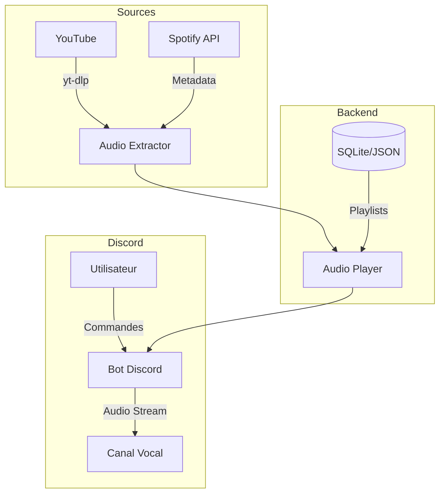

# Plan d'Implémentation - Bot Discord Musical (ba-tbot-v2)

Bot Discord en Python permettant de diffuser de la musique depuis YouTube et Spotify dans des canaux vocaux, avec gestion de playlists et support multi-serveur.

---

## Architecture Globale



---

## Structure du Projet

```
ba-tbot-v2/
├── bot/
│   ├── __init__.py
│   ├── main.py                 # Point d'entrée
│   ├── config.py               # Configuration
│   ├── bot.py                  # Classe principale du bot
│   │
│   ├── cogs/                   # Modules de commandes
│   │   ├── __init__.py
│   │   ├── music.py            # Commandes musicales
│   │   ├── playlist.py         # Gestion des playlists
│   │   └── utils.py            # Commandes utilitaires
│   │
│   ├── audio/                  # Gestion audio
│   │   ├── __init__.py
│   │   ├── player.py           # Lecteur audio
│   │   ├── queue.py            # File d'attente
│   │   ├── sources/
│   │   │   ├── __init__.py
│   │   │   ├── youtube.py      # Extraction YouTube
│   │   │   └── spotify.py      # Intégration Spotify
│   │   └── track.py            # Modèle de piste
│   │
│   ├── database/               # Persistance
│   │   ├── __init__.py
│   │   ├── base.py             # Interface DB
│   │   ├── sqlite.py           # Implémentation SQLite
│   │   └── models.py           # Modèles de données
│   │
│   └── utils/                  # Utilitaires
│       ├── __init__.py
│       ├── embeds.py           # Messages Discord formatés
│       └── helpers.py          # Fonctions utilitaires
│
├── tests/                      # Tests unitaires
│   ├── __init__.py
│   ├── test_player.py
│   ├── test_queue.py
│   └── test_playlist.py
│
├── requirements.txt
├── .env.example
├── README.md
└── run.py                      # Script de lancement
```

---

# Phase 1: Infrastructure & Configuration de Base

**Durée estimée**: 2-3 heures  
**Objectif**: Mettre en place la structure du projet et le bot Discord fonctionnel

## Sprint 1.1: Configuration de l'environnement

### [NEW] requirements.txt
```
discord.py[voice]==2.3.2
yt-dlp>=2024.8.6
spotipy>=2.23.0
aiohttp>=3.9.0
python-dotenv>=1.0.0
PyNaCl>=1.5.0
```

### [NEW] .env.example
```env
# Discord
DISCORD_TOKEN=your_discord_bot_token_here

# Spotify (optionnel)
SPOTIFY_CLIENT_ID=your_spotify_client_id
SPOTIFY_CLIENT_SECRET=your_spotify_client_secret

# Configuration
DATABASE_TYPE=sqlite
LOG_LEVEL=INFO
```

### [NEW] bot/config.py
- Chargement des variables d'environnement
- Configuration centralisée (préfixe, couleurs, limites)
- Validation des tokens requis

## Sprint 1.2: Structure de base du Bot

### [NEW] bot/bot.py
- Classe `MusicBot(commands.Bot)`
- Gestion du cycle de vie (on_ready, on_command_error)
- Chargement dynamique des cogs
- Stockage des players par guild (dict `guild_id -> MusicPlayer`)

### [NEW] bot/main.py
- Point d'entrée de l'application
- Configuration du logging
- Initialisation et lancement du bot

### [NEW] run.py
- Script de lancement simple

---

# Phase 2: Système Audio de Base

**Durée estimée**: 4-5 heures  
**Objectif**: Lecture audio fonctionnelle depuis YouTube

## Sprint 2.1: Modèles de données audio

### [NEW] bot/audio/track.py

```python
@dataclass
class Track:
    title: str
    url: str               # URL originale
    stream_url: str        # URL du stream audio
    duration: int          # Durée en secondes
    thumbnail: str         # URL de la miniature
    source: str            # 'youtube' | 'spotify'
    requester: discord.Member
```

### [NEW] bot/audio/queue.py

```python
class MusicQueue:
    """File d'attente thread-safe pour un serveur"""
    
    def add(track: Track) -> int          # Retourne position
    def next() -> Optional[Track]          # Pop le prochain
    def clear() -> None
    def shuffle() -> None
    def get_list() -> List[Track]
    def is_empty() -> bool
    def current() -> Optional[Track]
```

## Sprint 2.2: Extraction YouTube

### [NEW] bot/audio/sources/youtube.py

```python
class YouTubeSource:
    """Extraction audio via yt-dlp"""
    
    YTDL_OPTIONS = {
        'format': 'bestaudio/best',
        'extractaudio': True,
        'audioformat': 'mp3',
        'noplaylist': True,
        'nocheckcertificate': True,
        'quiet': True,
        'no_warnings': True,
        'default_search': 'auto',
    }
    
    async def search(query: str) -> Optional[Track]
    async def extract_playlist(url: str) -> List[Track]
    async def get_stream_url(url: str) -> str
```

## Sprint 2.3: Player Audio

### [NEW] bot/audio/player.py

```python
class MusicPlayer:
    """Gestionnaire audio pour un serveur Discord"""
    
    def __init__(self, bot: MusicBot, guild: discord.Guild):
        self.queue = MusicQueue()
        self.voice_client: Optional[discord.VoiceClient] = None
        self.current: Optional[Track] = None
        self.volume: float = 0.5
        self.loop: bool = False
        self._task: Optional[asyncio.Task] = None
    
    async def connect(channel: discord.VoiceChannel) -> None
    async def disconnect() -> None
    async def play(track: Track) -> None
    async def stop() -> None
    async def pause() -> None
    async def resume() -> None
    async def skip() -> None
    def set_volume(volume: float) -> None
    
    async def _player_loop() -> None  # Boucle de lecture
```

**Logique de la boucle de lecture**:
1. Attend qu'une piste soit disponible dans la queue
2. Extrait le stream URL si nécessaire
3. Crée un `FFmpegPCMAudio` avec les bons paramètres
4. Lance la lecture via `voice_client.play()`
5. Attend la fin via callback `after`
6. Passe à la piste suivante

---

# Phase 3: Commandes Musicales de Base

**Durée estimée**: 3-4 heures  
**Objectif**: Commandes play, stop, pause, resume, skip, volume

## Sprint 3.1: Cog Music

### [NEW] bot/cogs/music.py

```python
class Music(commands.Cog):
    """Commandes de lecture musicale"""
    
    def get_player(ctx) -> MusicPlayer
    
    @commands.command()
    async def play(ctx, *, query: str):
        """Joue une musique depuis YouTube ou ajoute à la queue"""
        # 1. Vérifier que l'utilisateur est dans un vocal
        # 2. Connecter le bot si nécessaire
        # 3. Rechercher la piste
        # 4. Ajouter à la queue
        # 5. Lancer la lecture si pas en cours
    
    @commands.command()
    async def stop(ctx):
        """Arrête la lecture et vide la queue"""
    
    @commands.command()
    async def pause(ctx):
        """Met en pause la lecture"""
    
    @commands.command()
    async def resume(ctx):
        """Reprend la lecture"""
    
    @commands.command()
    async def skip(ctx):
        """Passe à la piste suivante"""
    
    @commands.command()
    async def volume(ctx, vol: int):
        """Règle le volume (0-100)"""
    
    @commands.command()
    async def nowplaying(ctx):
        """Affiche la piste en cours"""
    
    @commands.command()
    async def queue(ctx):
        """Affiche la file d'attente"""
```

## Sprint 3.2: Messages Embed

### [NEW] bot/utils/embeds.py

```python
class MusicEmbeds:
    """Générateur d'embeds Discord pour la musique"""
    
    @staticmethod
    def now_playing(track: Track) -> discord.Embed
    
    @staticmethod
    def added_to_queue(track: Track, position: int) -> discord.Embed
    
    @staticmethod
    def queue_list(queue: MusicQueue, page: int = 1) -> discord.Embed
    
    @staticmethod
    def error(message: str) -> discord.Embed
    
    @staticmethod
    def success(message: str) -> discord.Embed
```

---

# Phase 4: Gestion des Playlists

**Durée estimée**: 4-5 heures  
**Objectif**: Sauvegarde et chargement de playlists personnalisées

## Sprint 4.1: Base de données

### [NEW] bot/database/models.py

```python
@dataclass
class Playlist:
    id: int
    name: str
    guild_id: int
    owner_id: int
    created_at: datetime
    tracks: List[PlaylistTrack]

@dataclass  
class PlaylistTrack:
    id: int
    playlist_id: int
    title: str
    url: str
    source: str
    position: int
```

### [NEW] bot/database/base.py

```python
class DatabaseInterface(ABC):
    """Interface abstraite pour la persistance"""
    
    @abstractmethod
    async def create_playlist(name: str, guild_id: int, owner_id: int) -> Playlist
    
    @abstractmethod
    async def get_playlist(playlist_id: int) -> Optional[Playlist]
    
    @abstractmethod
    async def get_playlists_by_guild(guild_id: int) -> List[Playlist]
    
    @abstractmethod
    async def delete_playlist(playlist_id: int) -> bool
    
    @abstractmethod
    async def add_track_to_playlist(playlist_id: int, track: Track) -> bool
    
    @abstractmethod
    async def remove_track_from_playlist(playlist_id: int, position: int) -> bool
```

### [NEW] bot/database/sqlite.py

```python
class SQLiteDatabase(DatabaseInterface):
    """Implémentation SQLite de la base de données"""
    
    async def init() -> None  # Création des tables
    # Implémentation de toutes les méthodes de l'interface
```

**Schéma SQLite**:
```sql
CREATE TABLE playlists (
    id INTEGER PRIMARY KEY AUTOINCREMENT,
    name TEXT NOT NULL,
    guild_id INTEGER NOT NULL,
    owner_id INTEGER NOT NULL,
    created_at TIMESTAMP DEFAULT CURRENT_TIMESTAMP,
    UNIQUE(name, guild_id)
);

CREATE TABLE playlist_tracks (
    id INTEGER PRIMARY KEY AUTOINCREMENT,
    playlist_id INTEGER NOT NULL,
    title TEXT NOT NULL,
    url TEXT NOT NULL,
    source TEXT NOT NULL,
    position INTEGER NOT NULL,
    FOREIGN KEY (playlist_id) REFERENCES playlists(id) ON DELETE CASCADE
);
```

## Sprint 4.2: Commandes Playlist

### [NEW] bot/cogs/playlist.py

```python
class PlaylistCog(commands.Cog):
    """Gestion des playlists"""
    
    @commands.command(name='save_playlist')
    async def save_playlist(ctx, name: str):
        """Sauvegarde la queue actuelle comme playlist"""
    
    @commands.command(name='load_playlist')
    async def load_playlist(ctx, name: str):
        """Charge une playlist dans la queue"""
    
    @commands.command(name='remove_playlist')
    async def remove_playlist(ctx, name: str):
        """Supprime une playlist"""
    
    @commands.command(name='list_playlists')
    async def list_playlists(ctx):
        """Liste toutes les playlists du serveur"""
```

---

# Phase 5: Intégration Spotify

**Durée estimée**: 3-4 heures  
**Objectif**: Support des liens Spotify (conversion vers YouTube)

## Sprint 5.1: Client Spotify

### [NEW] bot/audio/sources/spotify.py

```python
class SpotifySource:
    """Extraction de métadonnées Spotify"""
    
    def __init__(self, client_id: str, client_secret: str):
        self.sp = spotipy.Spotify(
            auth_manager=SpotifyClientCredentials(
                client_id=client_id,
                client_secret=client_secret
            )
        )
    
    async def get_track(url: str) -> Optional[SpotifyTrackInfo]
    async def get_playlist(url: str) -> List[SpotifyTrackInfo]
    async def get_album(url: str) -> List[SpotifyTrackInfo]
    
    def extract_id_from_url(url: str) -> Tuple[str, str]  # (type, id)
```

## Sprint 5.2: Conversion Spotify → YouTube

```python
@dataclass
class SpotifyTrackInfo:
    title: str
    artist: str
    album: str
    duration_ms: int
    
    @property
    def search_query(self) -> str:
        """Génère une query de recherche YouTube"""
        return f"{self.artist} - {self.title}"
```

**Logique de conversion**:
1. Extraire les métadonnées depuis Spotify (titre, artiste)
2. Construire une query de recherche
3. Rechercher sur YouTube via `YouTubeSource.search()`
4. Retourner le `Track` correspondant

---

# Phase 6: Optimisations Multi-Serveur

**Durée estimée**: 2-3 heures  
**Objectif**: Performance et stabilité en multi-serveur

## Sprint 6.1: Gestion des ressources

### Modifications dans bot/audio/player.py

- **Auto-déconnexion**: Déconnexion automatique après X minutes d'inactivité
- **Cleanup**: Libération des ressources lors de la déconnexion
- **Timeout**: Gestion du timeout de connexion vocale

### Modifications dans bot/bot.py

- **Player Management**: Création/destruction des players par guild
- **Event Handling**: Gestion des événements voice_state_update

## Sprint 6.2: Gestion des erreurs

```python
class MusicError(Exception):
    """Base exception pour les erreurs musicales"""

class NotInVoiceChannel(MusicError):
    """L'utilisateur n'est pas dans un canal vocal"""

class BotNotConnected(MusicError):
    """Le bot n'est pas connecté à un canal vocal"""

class TrackNotFound(MusicError):
    """Piste non trouvée"""

class PlaylistNotFound(MusicError):
    """Playlist non trouvée"""
```

---

# Phase 7: Fonctionnalités Avancées (Optionnel)

**Durée estimée**: 4-6 heures  
**Objectif**: Améliorations UX et fonctionnalités bonus

## Sprint 7.1: Commandes supplémentaires

- `shuffle` - Mélange la queue
- `loop` - Active/désactive la répétition
- `seek <time>` - Se déplacer dans la piste
- `remove <position>` - Retirer une piste de la queue
- `move <from> <to>` - Déplacer une piste dans la queue
- `clear` - Vider la queue sans arrêter

## Sprint 7.2: Interface interactive

- **Boutons Discord**: Contrôles play/pause/skip via boutons
- **Progress Bar**: Barre de progression dans nowplaying
- **Pagination**: Navigation dans les queues longues

## Sprint 7.3: Fonctionnalités bonus

- **Recherche interactive**: Sélection parmi plusieurs résultats
- **Lyrics**: Affichage des paroles (via API externe)
- **Audio Effects**: Equalizer basique

---

## Récapitulatif des Phases

| Phase | Description | Durée | Priorité |
|-------|-------------|-------|----------|
| 1 | Infrastructure & Configuration | 2-3h | 🔴 Critique |
| 2 | Système Audio de Base | 4-5h | 🔴 Critique |
| 3 | Commandes Musicales | 3-4h | 🔴 Critique |
| 4 | Gestion des Playlists | 4-5h | 🟠 Important |
| 5 | Intégration Spotify | 3-4h | 🟠 Important |
| 6 | Multi-Serveur & Optimisations | 2-3h | 🟡 Recommandé |
| 7 | Fonctionnalités Avancées | 4-6h | 🟢 Optionnel |

**Durée totale estimée**: 22-30 heures

---

## Dépendances Externes Requises

| Dépendance | Usage | Installation |
|------------|-------|--------------|
| [discord.py](https://discordpy.readthedocs.io/) | Framework Discord | `pip install discord.py[voice]` |
| [yt-dlp](https://github.com/yt-dlp/yt-dlp) | Extraction YouTube | `pip install yt-dlp` |
| [spotipy](https://spotipy.readthedocs.io/) | API Spotify | `pip install spotipy` |
| [PyNaCl](https://pynacl.readthedocs.io/) | Encryption vocale | `pip install PyNaCl` |
| [FFmpeg](https://ffmpeg.org/) | Traitement audio | Installation système |

> [!IMPORTANT]
> **FFmpeg** doit être installé sur le système et accessible dans le PATH.
> - Windows: `choco install ffmpeg` ou téléchargement manuel
> - Linux: `apt install ffmpeg`
> - macOS: `brew install ffmpeg`

---

## Prérequis Discord

1. **Créer une application** sur le [Discord Developer Portal](https://discord.com/developers/applications)
2. **Créer un Bot** et récupérer le token
3. **Activer les intents** requis:
   - `GUILDS`
   - `GUILD_VOICE_STATES`
   - `GUILD_MESSAGES`
   - `MESSAGE_CONTENT` (privilégié)
4. **Inviter le bot** avec les permissions:
   - `Connect` (se connecter aux vocaux)
   - `Speak` (jouer de l'audio)
   - `Send Messages`
   - `Embed Links`
   - `Use Slash Commands` (optionnel)

---

## Vérification

### Tests Automatisés

```bash
# Installation des dépendances de test
pip install pytest pytest-asyncio pytest-cov

# Exécution des tests
pytest tests/ -v --cov=bot
```

### Tests Manuels

1. **Phase 1**: Le bot démarre et se connecte à Discord
2. **Phase 2**: `!play <youtube_url>` joue de la musique
3. **Phase 3**: Toutes les commandes fonctionnent
4. **Phase 4**: Les playlists sont sauvegardées et rechargées
5. **Phase 5**: Les liens Spotify sont convertis et joués
6. **Phase 6**: Le bot fonctionne sur plusieurs serveurs simultanément

---

## Notes Techniques

> [!TIP]
> **Performance**: Utilisez `asyncio.create_task()` pour les opérations non-bloquantes comme l'extraction YouTube qui peut prendre du temps.

> [!WARNING]
> **Rate Limiting**: YouTube et Spotify ont des limites de requêtes. Implémentez du caching pour les recherches fréquentes.

> [!CAUTION]
> **Sécurité**: Ne commitez jamais le fichier `.env` contenant vos tokens. Utilisez `.gitignore`.
